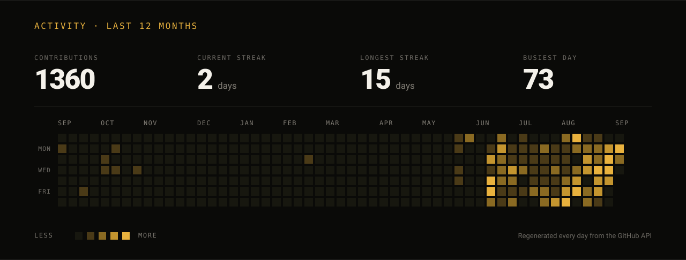
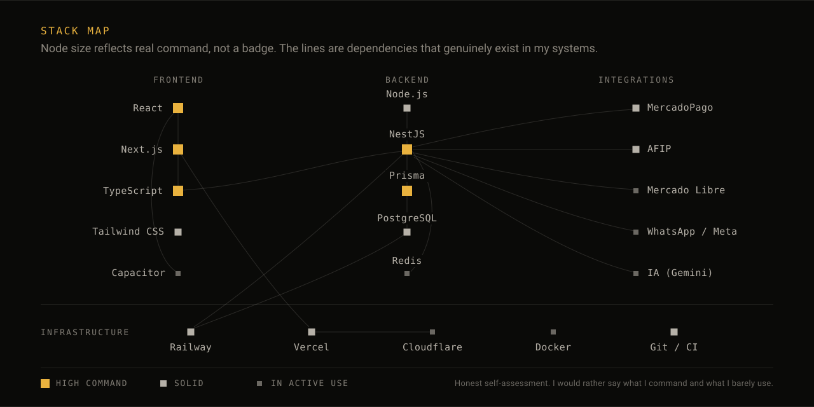

  <a href="README.md">Español</a>
  &nbsp;·&nbsp;
  <b>English</b>

---

I build products end to end: from the database schema to the pixel, from the first commit to the server that has to hold it up. I founded **[Pulso](https://pulsosoftware.com)**, a custom software company in Córdoba, Argentina, and there are shops invoicing every day on systems I wrote myself.

I do not ship demos. I ship systems that stay running, and I stay close, measuring and fixing.

 

 

## What I am building now

### Localazo &nbsp;·&nbsp; main project

A subscription platform that gives a small shop two things: its own public website at `{shop}.localazo.com.ar` and a back office to run the day to day.

The decision that shapes the whole project is that **the core knows nothing about verticals**. Barbershop, the first one, plugs in through a contract in `verticales/` without touching a single line of `nucleo/`. Adding the next vertical should not cost a refactor.

`Next.js` `TypeScript` `Drizzle` `PostgreSQL` `Railway` &nbsp;·&nbsp; [localazo.com.ar](https://localazo.com.ar)

### Blussi &nbsp;·&nbsp; non-profit adoption app

An app to get rescued dogs and cats off the street and into a family. Nobody ever pays anything. Everything is browsable without an account: you only need one to post a rescue, save favourites and chat.

`Next.js 16` `React 19` `TypeScript` `PostgreSQL 18` `Railway` &nbsp;·&nbsp; [blussi.vercel.app](https://blussi.vercel.app)

 

## Systems in production

| System | What it solves | |
| :--- | :--- | :--- |
| **MyA Importaciones** | Counter sales, online store and wholesale on one base. Over 2,300 products with variants and photos. The invoice is issued automatically when the sale closes. | [live](https://myaimportaciones.com.ar) |
| **Reseller catalogues** | Every reseller gets a catalogue on its own subdomain, with its logo and its prices, pulling stock from the shop. Domain provisioning runs itself. | [live](https://logiweb.catalogocba.com.ar) |
| **Logiweb Distribuciones** | Supplier price list imports, delivery notes exported to PDF and selling by half pack. | |
| **El Paso del Elefante** | Warehouse control by rack and position, timed tasks, and current accounts in pesos and dollars. | in progress |
| **Meli automation** | Several Mercado Libre accounts on one screen, with revenue, profit and margin already computed and each business kept separate. | |
| **Evolux** | Institutional site for an agency that scales brands inside Mercado Libre. | [live](https://evolux-rouge.vercel.app) |
| **Pulso control centre** | Internal console: clients, projects, tickets and payments. Production systems report into it, so I usually see the problem before the client does. | internal |

 

## Stack map

 

## Engineering decisions

What actually shows how I work is not the list of technologies, it is the decisions and what they cost.

**The core knows nothing about verticals** &nbsp;·&nbsp; *Localazo* 
A new vertical enters through the `verticales/` contract. If adding barbershop means touching `nucleo/`, the contract is badly designed. It costs more up front and pays for itself on the second vertical.

**Idempotent migrations, no migration engine** &nbsp;·&nbsp; *Blussi* 
A list of statements that runs in full on every cold start, taking a Postgres lock so two lambdas do not collide creating the same index. Schema changes are appended at the end and old ones are never edited, because they already ran in production. Fewer moving parts to maintain, and the real state of the database reads in a single pass.

**One commit, two domains, one variable** &nbsp;·&nbsp; *Blussi* 
The waitlist and the full app are the same build, separated by one environment variable. A proxy sends any route that should not be reachable yet back to the landing, so nobody stumbles into a half-finished product by guessing a URL. On launch day you change the variable, not the code.

**Real multi-tenancy** &nbsp;·&nbsp; *Pulso platform* 
Every shop runs on its own domain, with its own brand and isolated data. A reseller subdomain is created and verified automatically against the Vercel API: the shop adds the reseller and the catalogue goes live.

**From the counter to the invoice, in one flow** 
A sale at the point of sale drops stock, charges through MercadoPago and issues the AFIP invoice without leaving the screen. The hard part is not each integration on its own: it is making all three fail well when one of them goes down.

**An assistant that does not invent inventory** 
It answers only with the shop's real products, stock and prices, with prompt injection defences, and hands the conversation to a human when the sale gets serious. An assistant that hallucinates stock does more damage than no assistant at all.

 

## Education

**Software Development Diploma** &nbsp;·&nbsp; in progress, a few subjects from finishing.

Twelve certifications earned along the way:

| | | |
| :--- | :--- | :--- |
| Web development | Backend design and architecture | Scrum |
| JavaScript | Backend testing and scalability | Prompt engineering for AI |
| React | QA testing | Digital culture |
| Java | Cybersecurity | Advanced English |

 

## Track record

| | |
| :--- | :--- |
| **2022** | First client: the site for a roleplay server, hand built and delivered on time. It produced the one rule I still follow, which is to listen before writing code. |
| **2023** | Referrals start coming in. First real integrations: direct checkout with Mercado Pago inside the store. |
| **2024** | The diploma begins. Architecture, performance, quality and security stop being learned on the fly. |
| **2025** | The first complete management system, designed for one business from day one. |
| **jun 2026** | The first company selling on the system. Full migration without losing a single record. |
| **2026** | Pulso becomes a company, with several projects running in parallel. |

 

## Contact

**[pulsosoftware.com](https://pulsosoftware.com)** &nbsp;·&nbsp; [mateovpereyra@gmail.com](mailto:mateovpereyra@gmail.com)

Most of what I build is client code and lives in private repositories. What can be looked at is linked above, running.
