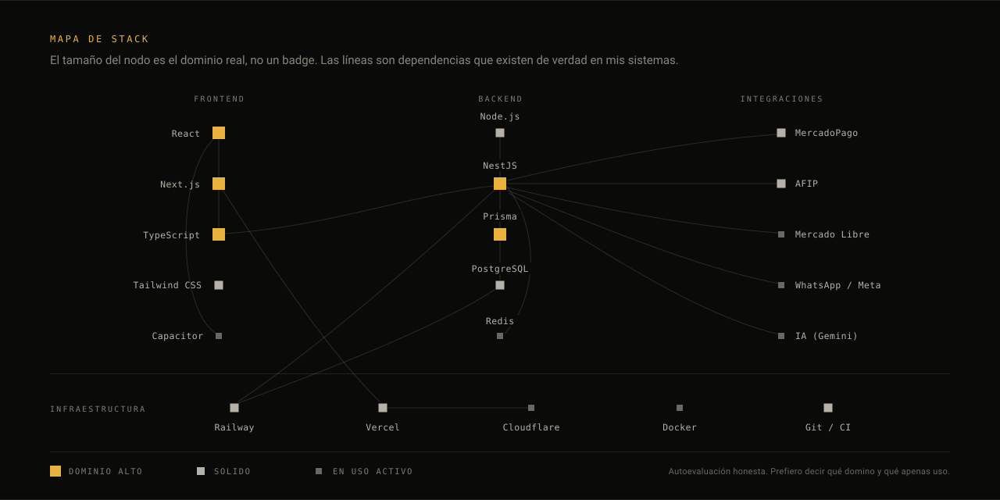

  <b>Español</b>
  &nbsp;·&nbsp;
  <a href="README.en.md">English</a>

---

Construyo productos de punta a punta: del esquema de base de datos al pixel, del primer commit al servidor que lo aguanta. Fundé **[Pulso](https://pulsosoftware.com)**, una empresa de software a medida en Córdoba, y hoy hay comercios que facturan todos los días sobre sistemas que escribí yo.

No entrego demos. Entrego sistemas que quedan andando, y me quedo cerca midiendo y corrigiendo.

 

## En qué estoy ahora

### Localazo &nbsp;·&nbsp; proyecto principal

Plataforma por suscripción que le da a un comercio chico dos cosas: una web pública propia en `{comercio}.localazo.com.ar` y un sistema para manejar el día a día.

La decisión que ordena todo el proyecto es que **el núcleo no sabe de rubros**. Barbería, el primer vertical, se enchufa por un contrato en `verticales/` sin tocar una línea de `nucleo/`. Sumar el rubro siguiente no debería costar un refactor.

`Next.js` `TypeScript` `Drizzle` `PostgreSQL` `Railway` &nbsp;·&nbsp; [localazo.com.ar](https://localazo.com.ar)

### Blussi &nbsp;·&nbsp; app de adopción, sin fines de lucro

App para rescatar perritos y gatitos de la calle y encontrarles familia. Nadie cobra nada, nunca. Se puede navegar todo sin cuenta: la cuenta hace falta sólo para publicar un rescate, guardar favoritos y chatear.

`Next.js 16` `React 19` `TypeScript` `PostgreSQL 18` `Railway` &nbsp;·&nbsp; [blussi.vercel.app](https://blussi.vercel.app)

 

## Sistemas en producción

| Sistema | Qué resuelve | |
| :--- | :--- | :--- |
| **MyA Importaciones** | Mostrador, tienda online y mayorista sobre la misma base. Más de 2.300 productos con variantes y fotos. La factura sale sola al cerrar la venta. | [ver](https://myaimportaciones.com.ar) |
| **Catálogos de revendedores** | Cada revendedor recibe su catálogo con su subdominio, su logo y sus precios, tomando el stock del comercio. El alta del dominio se hace sola. | [ver](https://logiweb.catalogocba.com.ar) |
| **Logiweb Distribuciones** | Importación de la lista de precios del proveedor, remitos exportables a PDF y venta por medio pack. | |
| **El Paso del Elefante** | Depósito por rack y posición, tareas con cronómetro y cuenta corriente en pesos y en dólares. | en desarrollo |
| **Sistema automático Meli** | Varias cuentas de Mercado Libre en una sola pantalla, con ingreso, ganancia y margen ya calculados y cada firma separada. | |
| **Evolux** | Web institucional de una agencia que escala marcas dentro de Mercado Libre. | [ver](https://evolux-rouge.vercel.app) |
| **Centro de control de Pulso** | Consola interna: clientes, proyectos, tickets y cobros. Los sistemas en producción le mandan señal, así casi siempre veo el problema antes que el cliente. | interno |

 

## Mapa de stack

 

## Decisiones de ingeniería

Lo que de verdad muestra cómo trabajo no es la lista de tecnologías, son las decisiones y lo que costaron.

**El núcleo no sabe de rubros** &nbsp;·&nbsp; *Localazo*
Un rubro nuevo entra por el contrato de `verticales/`. Si para agregar barbería hay que tocar `nucleo/`, el contrato está mal diseñado. Cuesta más al principio y se paga solo en el segundo rubro.

**Migraciones idempotentes, sin motor de migraciones** &nbsp;·&nbsp; *Blussi*
Una lista de sentencias que corre entera en cada arranque en frío, tomando un lock de Postgres para que dos lambdas no choquen creando el mismo índice. Para cambiar el esquema se agrega al final y lo viejo no se edita, porque ya corrió en producción. Menos piezas que mantener, y el estado real de la base se lee de una sola pasada.

**Un commit, dos dominios, una variable** &nbsp;·&nbsp; *Blussi*
La lista de espera y la app completa son el mismo build, separados por una variable de entorno. Un proxy manda a la landing cualquier ruta que todavía no corresponda, así nadie llega al proyecto a medio terminar adivinando una URL. El día del lanzamiento se cambia la variable, no el código.

**Multi-tenant de verdad** &nbsp;·&nbsp; *plataforma de Pulso*
Cada comercio opera con su dominio propio, su marca y sus datos aislados. El subdominio de un revendedor se crea y se verifica solo contra la API de Vercel: el comercio lo da de alta y el catálogo queda publicado.

**Del mostrador a la factura, en un solo flujo**
Una venta en el punto de venta descuenta stock, cobra con MercadoPago y factura en AFIP sin salir de la pantalla. La parte difícil no es cada integración por separado: es que las tres fallen bien cuando una se cae.

**Un asistente que no inventa catálogo**
Responde sólo con productos, stock y precios reales del comercio, con defensa contra inyección de prompt, y deriva al vendedor humano cuando la charla avanza. Un asistente que alucina stock hace más daño que no tener asistente.

 

## Formación

**Diplomatura en Desarrollo de Software** &nbsp;·&nbsp; en curso, a pocas materias de recibirme.

Doce certificaciones obtenidas en el camino:

| | | |
| :--- | :--- | :--- |
| Desarrollo web | Diseño y arquitectura backend | Scrum |
| JavaScript | Testing y escalabilidad backend | Prompt Engineering para IA |
| React JS | Testing QA | Cultura digital |
| Java | Ciberseguridad | Inglés avanzado |

 

## Recorrido

| | |
| :--- | :--- |
| **2022** | Primer cliente: la web de un servidor de rol, hecha a mano y entregada en fecha. De ahí salió la única regla que sigo usando: escuchar antes de escribir código. |
| **2023** | Llegan por recomendación. Primeras integraciones de verdad: compra directa con Mercado Pago dentro de la tienda. |
| **2024** | Arranca la diplomatura. Arquitectura, rendimiento, calidad y seguridad dejan de aprenderse sobre la marcha. |
| **2025** | El primer sistema de gestión completo, pensado para una empresa desde el primer día. |
| **jun 2026** | La primera empresa vendiendo sobre el sistema. Migración completa sin perder un solo dato. |
| **2026** | Pulso pasa a ser una empresa, con varios proyectos en paralelo. |

 

## Contacto

**[pulsosoftware.com](https://pulsosoftware.com)** &nbsp;·&nbsp; [mateovpereyra@gmail.com](mailto:mateovpereyra@gmail.com)

La mayor parte de lo que construyo es código de clientes y vive en repositorios privados. Lo que se puede mirar está enlazado acá arriba, funcionando.
